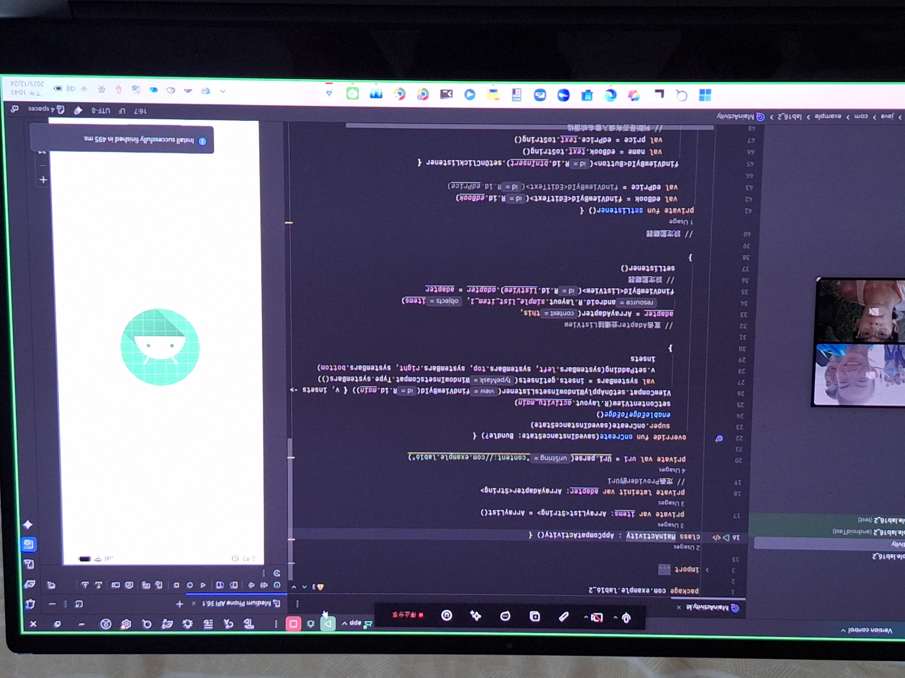

# kotlin 程式碼練習

## 心得

這次的練習包含了重複利用 View 和背景執行的部分，這兩個技術都跟使用者介面和執行效率、穩定度息息相關。透過學習重複利用 View，我了解如何提升 UI 的效能，避免不必要的資源浪費。而背景執行則是讓程式能夠在不影響使用者操作的情況下，處理需要時間的任務，像是非同步執行的部分，使用 Coroutines 讓這些操作變得簡單又高效。

這兩者的結合不僅提升了程式的效能，也讓使用者的體驗更加流暢，整體的開發效率和穩定度都有所提升。

## Github

### 網址：
[https://github.com/Dao-you/Homework1211](https://github.com/Dao-you/Homework1211)

### 截圖：

# 讀書會

* 組員：方宇澤
* 討論時間：2025/12/11 22:00 ~ 22:30
* 地點：LINE 通話
* 討論主題：關於背景執行緒部分的原理討論

